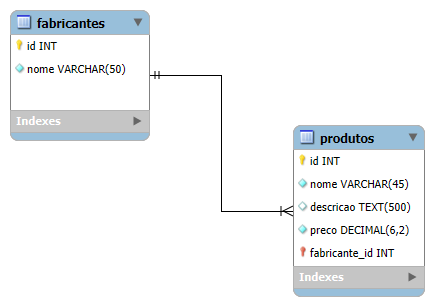
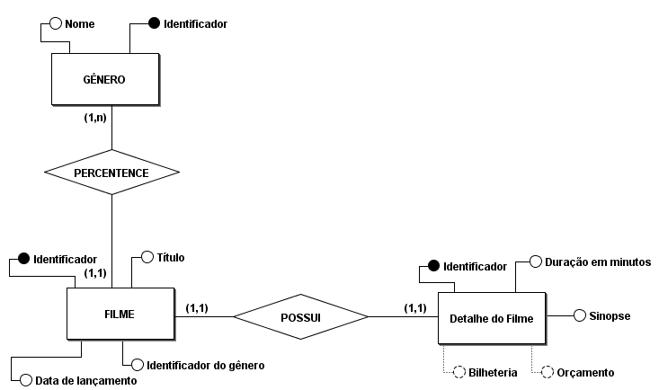
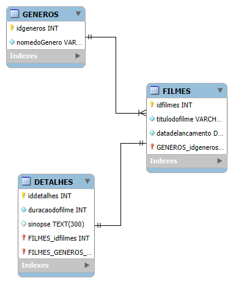

# Exemplos e exercicios de Banco de Dados

## Exemplo de Modelagem Conceitual

## Exemplo de Modelagem Lógica

## Exemplos de modelagem Conceitual de acordo com o último exercicio

## Exemplos de modelagem Lógica de acordo com o último exercicio

